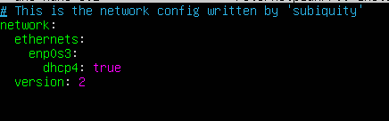
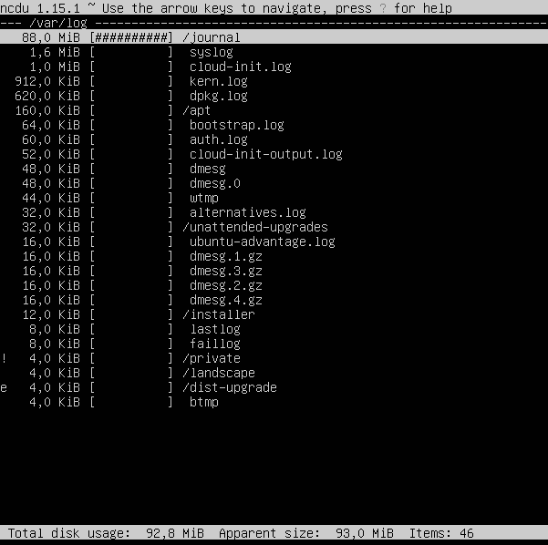

# Решение задания

1. [Установка ОС](#part-1-установка-ос)  
2. [Создание пользователя](#part-2-создание-пользователя)  
3. [Настройка сети ОС](#part-3-настройка-сети-ос)   
4. [Обновление ОС](#part-4-обновление-ос)  
5. [Использование команды  sudo](#part-5-использование-команды-sudo)  
6. [Установка и настройка службы времени](#part-6-установка-и-настройка-службы-времени)  
7. [Установка и использование текстовых редакторов](#part-7-установка-и-использование-текстовых-редакторов)  
8. [Установка и базовая настройка сервиса SSHD](#part-8-установка-и-базовая-настройка-сервиса-sshd)   
9. [Установка и использование утилит top, htop](#part-9-установка-и-использование-утилит-top-htop)   
10. [Использование утилиты fdisk](#part-10-использование-утилиты-fdisk)   
11. [Использование утилиты df](#part-11-использование-утилиты-df)    
12. [Использование утилиты du](#part-12-использование-утилиты-du)    
13. [Установка и использование утилиты ncdu](#part-13-установка-и-использование-утилиты-ncdu)    
14. [Работа с системными журналами](#part-14-работа-с-системными-журналами)     
15. [Использование планировщика заданий CRON](#part-15-использование-планировщика-заданий-cron)    

## Part 1. Установка ОС

**== Задание ==**

##### Установить **Ubuntu 20.04 Server LTS** без графического интерфейса. (Используем программу для виртуализации - VirtualBox)

- Графический интерфейс должен отсутствовать.

- Узнайте версию Ubuntu, выполнив команду \
`cat /etc/issue.`
- Вставьте скриншот с выводом команды.

**== Решение ==**

- Установленна программа VirtualBox, и добавлен образ Ubuntu 20.04.2 Server LTS без графического интерфейса 

    
    
- Прогресс установки ОС

    
- Результат выполнения команды `cat /etc/issue`:

    

## Part 2. Создание пользователя

**== Задание ==**

##### Создать пользователя, отличного от пользователя, который создавался при установке. Пользователь должен быть добавлен в группу `adm`.

- Вставьте скриншот вызова команды для создания пользователя.
- Новый пользователь должен быть в выводе команды \
`cat /etc/passwd`
- Вставьте скриншот с выводом команды.

**== Решение ==**

- Создадим нового пользователя `(artemnew)` с помощью команды:
    ```
    sudo adduser artemnew
    ```

    

- Добавим нового пользователя `(artemnew)` в группу `adm` с помощью команды:
    ```
    sudo usermod -a -G adm artemnew
    ```

    

- Новый пользователь присутствует в выводе команды
`cat /etc/passwd`

    

## Part 3. Настройка сети ОС

**== Задание ==**

##### Задать название машины вида user-1  
##### Установить временную зону, соответствующую вашему текущему местоположению.  
##### Вывести названия сетевых интерфейсов с помощью консольной команды.
- В отчёте дать объяснение наличию интерфейса lo.  
##### Используя консольную команду получить ip адрес устройства, на котором вы работаете, от DHCP сервера. 
- В отчёте дать расшифровку DHCP.  
##### Определить и вывести на экран внешний ip-адрес шлюза (ip) и внутренний IP-адрес шлюза, он же ip-адрес по умолчанию (gw). 
##### Задать статичные (заданные вручную, а не полученные от DHCP сервера) настройки ip, gw, dns (использовать публичный DNS серверы, например 1.1.1.1 или 8.8.8.8).  
##### Перезагрузить виртуальную машину. Убедиться, что статичные сетевые настройки (ip, gw, dns) соответствуют заданным в предыдущем пункте.  

- В отчёте опишите, что сделали для выполнения всех семи пунктов (можно как текстом, так и скриншотами).
- Успешно пропинговать удаленные хосты 1.1.1.1 и ya.ru и вставить в отчёт скрин с выводом команды. В выводе команды должна быть фраза "0% packet loss".

**== Решение ==**

- Используя команду переходим в файл где хранится название для `hostname` и изменяем его.
    ```
    sudo nano /etc/hostname
    ```

- Делаем `reboot` и проверяем сохранилось ли название `hostname`. После определяем нужный нам часовой пояс используя команду
    ```
    tzselect
    ```
    


- После выбора нужных параметров, система подсказывает, что нужно использовать `Asia/Novosibirsk`. Чтобы установить часовой пояс и увидеть его, воспользуемся командами:
    ```
    sudo timedatectl set-timezone Asia/Novosibirsk
    ```
    ```
    date
    ```
    

- Чтобы вывести названия сетевых интерфейсов с помощью консольных команд:
    ```
    ip link show
    ```
    ```
    ip a
    ```
   

- >lo (loopback device) – виртуальный интерфейс, присутствующий по умолчанию в любом Linux. Он используется для отладки сетевых программ и запуска серверных приложений на локальной машине. С этим интерфейсом всегда связан адрес 127.0.0.1. У него есть dns-имя – localhost. Интерфейс lo является локальной петлёй. Она предназначена для обеспечения сетевого доступа к компьютеру.

---

- Для выявления IP-адреса, предоставленного машине DHCP-сервером, можно использовать следующую команду:
    ```
    cat /var/log/syslog | grep -i dhcp
    ```

    
    
- Изображение отражает, что DHCP присвоил компьютеру следующий IP-адрес: 10.0.2.15/24.

- Информацию о IP-адресе, предоставленном DHCP-сервером, можно получить, выполнив следующую команду: 
    ```
    ip r
    ```
    

- >DHCP (Dynamic Host Configuration Protocol) - протокол динамической конфигурации хоста. Сетевой протокол, позволяющий устройствам автоматически получать IP-адрес и другие параметры, необходимые для работы в сети TCP/IP. Данный протокол работает по модели «клиент-сервер». Для автоматической конфигурации компьютер-клиент на этапе конфигурации сетевого устройства обращается к так называемому серверу DHCP и получает от него нужные параметры. IP-адрес (Internet Protocol) - способ адресации устройств по сети.

---
- Для того чтобы определить и вывести на экран внешний IP-адрес шлюза, можно воспользоваться следующей командой:
    ```
    curl ifconfig.co
    ```
    


- Для того чтобы определить и вывести на экран внутренний IP-адрес шлюза (он же IP-адрес по умолчанию), можно воспользоваться следующими командами в зависимости от операционной системы:
    ```
    ip route
    ```
    ```
    route -n
    ```
    
    
- Как видно из скриншотов, внешний IP-адрес шлюза: 109.174.126.111; а внутренний: 10.0.2.2.
---

- Чтобы изменить статические настройки IP, шлюза (gw), и DNS (с использованием общедоступных DNS-серверов, например, 1.1.1.1 или 8.8.8.8), вам нужно отключить облачную инициализацию, задав все параметры вручную. Для этого отредактируйте файл конфигурации subiquity-disable-cloudinit-networking.cfg в каталоге /etc/cloud/cloud.cfg.d/ следующим образом:
```
sudo nano /etc/cloud/cloud.cfg.d/subiquity-disable-cloudinit-networking.cfg
```

- Необходимо, чтобы было: `config: disabled`

    

- Откроем файл конфигурации `netplan` в текстовом редакторе `nano` с помощью команды:
    ```
    sudo nano /etc/netplan/00-installer-config.yaml
    ```

    

- Зададим статические настройки: изменим параметр dhcp4 на значение `false`, в `addresses` укажем статический IP-адрес: `10.0.2.15/24`, и в `gateway4` зададим внутренний IP-адрес `10.0.2.2`. В параметре `addresses` раздела `nameservers` укажем публичные серверы.

    

- Для применения изменений используем команду:
    ```
    netplan apply
    ```
    

- Далее перезагрузим виртуальную машину командой `reboot` и проверяем сохранились ли выставленные вручную настройки (проверяем сохранились ли изменения в файле конфигурации). Для этого воспользуемся командой:
    ```
    cat /etc/netplan/00-installer-config.yaml
    ```

    

- Также, для проверки статического IP-адреса можно использовать команды:
    ```
    ip route show
    ```
    ```
    ifconfig
    ```

    

- На скриншотах видно, что выставленный вручную статический IP-адрес `10.0.2.15` после перезагрузки остался неизменным.
---

- Пропингуем удаленные хосты 1.1.1.1 и ya.ru с помощью команд:
    ```
    ping 1.1.1.1 -c 5
    ```
    ```
    ping ya.ru -c 5
    ```
    

- Изображение демонстрирует, что результат выполнения команды содержит фразу "0% packet loss", что свидетельствует о том, что компьютер получил успешные ответы от всех отправленных пакетов данных на указанные серверы.

- >Ping — утилита для проверки целостности и качества соединений в сетях. Утилита отправляет запросы указанному узлу сети и фиксирует поступающие ответы. Время между отправкой запроса и получением ответа позволяет определять двусторонние задержки по маршруту и частоту потери пакетов, то есть косвенно определять загруженность на каналах передачи данных и промежуточных устройствах.

## Part 4. Обновление ОС

**== Задание ==**

##### Обновить системные пакеты до последней на момент выполнения задания версии.  

- После обновления системных пакетов, если ввести команду обновления повторно, должно появится сообщение, что обновления отсутствуют.
- Вставить скриншот с этим сообщением в отчёт.

**== Решение ==**

- Для обновления индекса пакетов или списка пакетов, воспользуемся командой:
    ```
    sudo apt update
    ```
- Обновим системные пакеты до последней, на момент выполнения задания, версии, используя команду:
    ```
    sudo apt full-upgrade
    ```
    

- После обновления системных пакетов видим, что при повторном введении команд для обновления получены сообщения об отсутствии новых обновлений
    

## Part 5. Использование команды **sudo**

**== Задание ==**

##### Разрешить пользователю, созданному в [Part 2](#part-2-создание-пользователя), выполнять команду sudo.

- В отчёте объяснить *истинное* назначение команды sudo (про то, что это слово - "волшебное", писать не стоит).  
- Поменять hostname ОС от имени пользователя, созданного в пункте [Part 2](#part-2-создание-пользователя) (используя sudo).
- Вставить скрин с изменённым hostname в отчёт.

**== Решение ==**

- Разрешим пользователю, созданному в [Part 2](#part-2-создание-пользователя), выполнять команду sudo. Для этого необходимо добавить пользователя `artemnew` в группу `sudo`. Воспользуемся командой:
    ```
    sudo usermod -a -G sudo artemnew
    ```
- Проверим к каким группам принадлежит пользователь `artemnew` с помощью команды:
    ```
    groups artemnew
    ```

    

- На скриншоте видно, что пользователь был добавлен в группу `sudo`. Это дает ему возможность выполнять команду `sudo`.

- >Sudo (Substitute user and do - подменить пользователя и выполнить) – это утилита для операционных систем семейства Linux, позволяющая пользователю запускать программы с привилегиями другой учётной записи, как правило, суперпользователя.

- Поменяем hostname ОС от имени пользователя, созданного в пункте [Part 2](#part-2-создание-пользователя) (используя sudo). Для этого необходимо сменить текущего пользователя `artem` на ранее созданного `artemnew` с помощью команды:
    ```
    su artemnew
    ```

    

- Чтобы узнать текущее имя хоста воспользуемся командой:
    ```
    hostnamectl
    ```
- Изменим имя хоста с `user-1` на `user-2` с помощью команды:
    ```
    sudo hostnamectl set-hostname user-2
    ```
- Проверим изменения командой:
    ```
    hostname
    ```

    

- Выполним перезагрузку машины командой `reboot` и проверим сохранность изменений:

    

## Part 6. Установка и настройка службы времени

**== Задание ==**

##### Настроить службу автоматической синхронизации времени.  

- Вывести время, часового пояса, в котором вы сейчас находитесь.
- Вывод следующей команды должен содержать `NTPSynchronized=yes`: \
  `timedatectl show`
- Вставить скрины с корректным временем и выводом команды в отчёт.

**== Решение ==**

- С помощью команды `date` выведем текущее время часового пояса, в котором мы находимся.

- Для вывода настроек часового пояса, используем команду:
    ```
    timedatectl show
    ```

    

- >На изображении заметно, что результат выполнения команды `timedatectl show` включает в себя строку `NTPSynchronized=yes`. Указанная запись подтверждает активацию протокола NTP (сетевого протокола времени). NTP - это протокол, отвечающий за синхронизацию времени компьютера со стандартными эталонными часами через интернет с помощью иерархии серверов NTP.

## Part 7. Установка и использование текстовых редакторов 

**== Задание ==**

##### Установить текстовые редакторы **VIM** (+ любые два по желанию **NANO**, **MCEDIT**, **JOE** и т.д.)  
##### Используя каждый из трех выбранных редакторов, создайте файл *test_X.txt*, где X -- название редактора, в котором создан файл. Напишите в нём свой никнейм, закройте файл с сохранением изменений.  
- В отчёт вставьте скриншоты:
  - Из каждого редактора с содержимым файла перед закрытием.
- В отчёте укажите, что сделали для выхода с сохранением изменений.
##### Используя каждый из трех выбранных редакторов, откройте файл на редактирование, отредактируйте файл, заменив никнейм на строку "21 School 21", закройте файл без сохранения изменений.
- В отчёт вставьте скриншоты:
    - Из каждого редактора с содержимым файла после редактирования.
- В отчёте укажите, что сделали для выхода без сохранения изменений.
##### Используя каждый из трех выбранных редакторов, отредактируйте файл ещё раз (по аналогии с предыдущим пунктом), а затем освойте функции поиска по содержимому файла (слово) и замены слова на любое другое.
- В отчёт вставьте скриншоты:
    - Из каждого редактора с результатами поиска слова.
    - Из каждого редактора с командами, введёнными для замены слова на другое.

**== Решение ==**

- Выполним установку текстовых редакторов командами:
    ```
    sudo apt install vim
    ```
    ```
    sudo apt install nano
    ```
    ```
    sudo apt install mcedit
    ```
---
### Запись никнейма в файлы и закрытие с сохранением

- VIM. Запишем никнейм `marlonan`:

    
    

    - Для выхода с сохранением изменений нужно нажать `ESC`, затем написать `:wq`, что означает write and quit.

- NANO. Запишем никнейм `marlonan`:

    

    - Для выхода с сохранением изменений нужно нажать `Ctrl+S` и затем `Ctrl+X`.

- MCEDIT. Запишем никнейм `marlonan`:

    

    - Для выхода с сохранением изменений нужно нажать `F10` и выбрать `Yes`

- Проверим сохранились ли все файлы под нужным названием используя команду:
    ```
    ls
    ```
    

---
### Запись "21 School 21" в файлы с выходом без сохранения

- VIM. Запишем "21 School 21":

    

    - Для выхода без сохранения нужно нажать `ESC`, затем написать `:q!`. Проверим, что изменения не сохранились:

    

- NANO. Запишем "21 School 21":

    

    - Для выхода без сохранения изменений нужно нажать `Ctrl+X`. Проверим, что изменения не сохранились:

    

- MCEDIT. Запишем "21 School 21":

    

    - Для выхода без сохранения изменений нужно нажать `F10` и выбрать `No`

    

    - Проверим, что изменения не сохранились:

    

---

### Поиск по слову в файлах
- Внесем изменения с предыдущего пункта (запишем в файлы "21 School 21") и сохраним их.

- **VIM**

    - Поиск:
    `ESC + /<слово_для_поиска>`
    
    

    - Замена:
    `:s/<заменяемое>/<заменитель>`

    

- **NANO**

    - Поиск:
    `Ctrl + W`
    
    

    - Замена:
    `Ctrl + \`

    

    - Вводим слово для замены:

    

    - Применяем замену:

    

- **MCEDIT**

    - Поиск:
    `F7`
    
    

    - Вводим и подтверждаем слово для поиска:

    

    - Замена:
    `F4`

    

    - Вводим и подтверждаем слово для замены:

    

## Part 8. Установка и базовая настройка сервиса **SSHD**

**== Задание ==**

##### Установить службу SSHd.  
##### Добавить автостарт службы при загрузке системы.  
##### Перенастроить службу SSHd на порт 2022.  
##### Используя команду ps, показать наличие процесса sshd. Для этого к команде нужно подобрать ключи.
- В отчёте объяснить значение команды и каждого ключа в ней.
##### Перезагрузить систему.
- В отчёте опишите, что сделали для выполнения всех пяти пунктов (можно как текстом, так и скриншотами).
- Вывод команды netstat -tan должен содержать  \
`tcp 0 0 0.0.0.0:2022 0.0.0.0:* LISTEN`  \
(если команды netstat нет, то ее нужно установить)
- Скрин с выводом команды вставить в отчёт.
- В отчёте объяснить значение ключей -tan, значение каждого столбца вывода, значение 0.0.0.0.

**== Решение ==**

- Установим службу SSHd с помощью команды:
    ```
    sudo apt install openssh-server
    ```

- Узнаем состояние SSHd службы, воспользовавшись командой:
    ```
    sudo systemctl status ssh
    ```

    

- Изображение указывает на то, что автозапуск службы SSHd был добавлен автоматически при загрузке системы. Чтобы включить автостарт можно воспользоваться командой `sudo systemctl enable ssh`, для выключения автостарта команда `sudo systemctl disable ssh`.

- Для перенастройки службы SSHd на порт 2022 откроем файл `sshd_config` с помощью команды:
    ```
    sudo nano /etc/ssh/sshd_config
    ```
- Изменим значение параметра `Port` с 22 на 2022

    

- Перезагрузим сервис SShd используя команду `service ssh restart` и проверим состояние SSHd службы после изменения порта командой `sudo systemctl status ssh`

    

    - На скриншоте видно, что порт изменен.

- Покажем наличие процесса sshd, используя команду:
    ```
    ps aux | grep -i ssh
    ```

    

    - >ps - утилита для просмотра списка процессов в Linux. Параметр `-a` - выбрать все процессы всех пользователей, кроме фоновых. Параметр `-u` обозначает ориентированный на пользователя формат, который предоставляет подробную информацию о процессах. Параметр `-x` указывает `ps` перечислить процессы без управляющего терминала. В основном это процессы, которые запускаются во время загрузки и работают в фоновом режиме.\
    `grep -i ssh` - выводит только те строчки, где есть ssh с игнорированием регистра за счет `-i`.\
    Символ `|` перенаправляет вывод команды `ps aux` на ввод `grep -i ssh`.

- Выполним перезагрузку машины командой `reboot` и выполним команду:
    ```
    netstat -tan
    ```

    

- Как видно на скриншоте, вывод команды содержит `tcp 0 0 0.0.0.0:2022 0.0.0.0:* LISTEN`, что соответствует требованию задания.

- >`netstat -tan`\
Команда `netstat` показывает статистику приема и отправки пакетов, а также информацию об ошибках приема и отправки.
`-a` - Вывод всех активных подключений TCP и прослушиваемых компьютером портов TCP и UDP.\
`-n` - Вывод активных подключений TCP с отображением адресов и номеров портов в числовом формате без попыток определения имен.
Тогда, если `netstat -na` - просмотр всех открытых протоколов, то `netstat -tan` - просмотр всех открытых ТСР-протоколов.\
При вызове команды в терминал выводится таблица, столбцы которой имеют следующие значения:\
а) `Proto` - сетевой протокол (tcp, udp);\
б) `Recv-Q` - количество байтов, помещённых в буфер приёма TCP/IP, но не переданных приложению. Если это число высокое, то нужно проверить работоспособность приложения, которое работает с данным портом.\
в) `Send-Q` — количество байтов, помещённых в буфер отправки TCP/IP, но не отправленных, или отправленных, но не подтверждённых. Высокое значение может быть связано с перегрузкой сети сервера.\
г) `Local Address` — локальный адрес сервера. В обычных соединениях, это адрес сервера на который пришло соединение. В прослушиваемых портах (LISTEN) — это диапазон адресов. Так 0.0.0.0:port — значит подключаться можно ко всем адресам сервера, а 192.168.0.35:port — значит подключаться можно только к этому адресу сервера.\
д) `Foreign Address` — адрес второй стороны. В обычных соединениях, это адрес с которого пришло соединение. В прослушиваемых портах (LISTEN) — это диапазон адресов. Так 0.0.0.0:* — значит подключаться можно с любых адресов и с любых портов, а например 192.168.0.50:* — значит подключаться можно только с этого адреса и с любых портов.\
е) `State` — состояние подключения, или прослушивания.

## Part 9. Установка и использование утилит **top**, **htop**

**== Задание ==**

##### Установить и запустить утилиты top и htop.  

- По выводу команды top определить и написать в отчёте:
  - uptime
  - количество авторизованных пользователей
  - общую загрузку системы
  - общее количество процессов
  - загрузку cpu
  - загрузку памяти
  - pid процесса занимающего больше всего памяти
  - pid процесса, занимающего больше всего процессорного времени
- В отчёт вставить скрин с выводом команды htop:
  - отсортированному по PID, PERCENT_CPU, PERCENT_MEM, TIME
  - отфильтрованному для процесса sshd
  - с процессом syslog, найденным, используя поиск 
  - с добавленным выводом hostname, clock и uptime  

**== Решение ==**

- Команда `top` выводит на экран:

    

  - uptime - 5 минут;
  - количество авторизованных пользователей - 1;
  - общую загрузку системы - 0.00, 0.07, 0.04;
  - общее количество процессов - 99;
  - загрузку cpu - 0.0 %;
  - загрузку памяти - 165.6 из 1964.1;
  - pid процесса занимающего больше всего памяти - 1;
  - pid процесса, занимающего больше всего процессорного времени - 1047 и 297.

- htop:
    - Вывод команды без сортировки

    

    - Для сортировки в `htop` нужно нажать `F6` и выбрать параметр сортировки.
    - `htop` отсортированный по `PID`

    

    - `htop` отсортированный по `PERCENT_CPU`

    

    - `htop` отсортированный по `PERCENT_MEM`

    

    - `htop` отсортированный по `TIME`

    

    - Для использования фильтров в `htop` нужно нажать `F4` и выбрать параметр фильтрации.
    - htop, отфильтрованный для процесса SSHd

    

    - Для использования поиска в `htop` нужно нажать `F3` и ввести объект поиска. `htop` с процессом `syslog`, найденным, используя поиск

    

    - Для добавления отображения дополнительных параметров в `htop`, необходимо нажать `F2` и добавить требуемые параметры. `htop` с добавленным выводом hostname, clock и uptime

    

## Part 10. Использование утилиты **fdisk**

**== Задание ==**

##### Запустить команду fdisk -l.

- В отчёте написать название жесткого диска, его размер и количество секторов, а также размер swap.

**== Решение ==**

##### Запустить команду fdisk -l.

- Выполним команду:
    ```
    fdisk -l
    ```
    
    

- Что бы определить размер swap воспользуемся командой:
    ```
    free -m
    ```
    - Раздел подкачки в Linux или SWAP раздел позволяет использовать жесткий диск для сохранения информации, которая должна сохраняться в оперативной памяти и при этом в оперативную память не помещается.

    


    - Название жесткого диска: VBOX HARDDISK (/dev/sda);
    - Размер диска: 25 Гигабайт;
    - Количество секторов: 52428800;
    - Общий размер swap: 2047;
    - Используемый размер swap: 0;

## Part 11. Использование утилиты **df** 

**== Задание ==**

##### Запустить команду df.  
- В отчёте написать для корневого раздела (/):
  - размер раздела
  - размер занятого пространства
  - размер свободного пространства
  - процент использования
- Определить и написать в отчёт единицу измерения в выводе.  

##### Запустить команду df -Th.
- В отчёте написать для корневого раздела (/):
    - размер раздела
    - размер занятого пространства
    - размер свободного пространства
    - процент использования
- Определить и написать в отчёт тип файловой системы для раздела.

**== Решение ==**
- Выполним команду:
    ```
    df
    ```

    

    >Для корневого раздела (/):\
        - Размер раздела: 11758760;\
        - Размер занятого пространства: 5376368;\
        - Размер свободного пространства: 5763284;\
        - Процент использования: 49 %;\
        Единицы измерения при выводе: Килобайты.
- Выполним команду:
    ```
    df -Th
    ```

    

    >Для корневого раздела (/):\
        - Размер раздела: 12;\
        - Размер занятого пространства: 5.2;\
        - Размер свободного пространства: 5.5;\
        - Процент использования: 49 %;\
        Единицы измерения при выводе: Гигабайты.\
        Тип файловой системы: Ext4 - журналируемая файловая система, используемая в ОС на ядре Linux. Основана на файловой системе Ext3, но отличается тем, что в ней представлен механизм записи файлов в непрерывные участки блоков (екстенты), уменьшающий фрагментацию и повышающий производительность. В ней есть журналирование, то есть в ней предусмотрена запись некоторых данных, позволяющих восстановить файловую систему при сбоях в работе компьютера.

## Part 12. Использование утилиты **du**

**== Задание ==**

##### Запустить команду du.
##### Вывести размер папок /home, /var, /var/log (в байтах, в человекочитаемом виде)
##### Вывести размер всего содержимого в /var/log (не общее, а каждого вложенного элемента, используя *)

- В отчёт вставить скрины с выводом всех использованных команд.

**== Решение ==**
- Выполним команду:
    ```
    du
    ```

    

- Вывод размера папки /home в байтах и в человекочитаемом виде командами:
    ```
    sudo du -s /home/
    ```
    ```
    sudo du -sh /home/
    ```

    

- Вывод размера папки /var в байтах и в человекочитаемом виде командами:
    ```
    sudo du -s /var/
    ```
    ```
    sudo du -sh /var/
    ```

    

- Вывод размера папки /var/log в байтах и в человекочитаемом виде командами:
    ```
    sudo du -s /var/log/
    ```
    ```
    sudo du -sh /var/log/
    ```

    


- Вывод размера всего содержимого папки (каждого вложенного элемента) /var/log с использованием `*` командой:
    ```
    sudo du /var/log/* | less
    ```

    

## Part 13. Установка и использование утилиты **ncdu**

**== Задание ==**

##### Установить утилиту ncdu.
##### Вывести размер папок /home, /var, /var/log.

- Размеры должны примерно совпадать с полученными в [Part 12](#part-12-использование-утилиты-du).

- В отчёт вставить скрины с выводом использованных команд.

**== Решение ==**

- Установим утилиту `ncdu` командой:
    ```
    sudo apt install ncdu
    ```

- Выведем размер папки `/home`:

    

- Выведем размер папки `/var`:

    

- Выведем размер папки `/var/log`:

    

- На скриншотах видно, размеры папок примерно совпадают с полученными в `части 12` [Part 12](#part-12-использование-утилиты-du) задания.

## Part 14. Работа с системными журналами

**== Задание ==**

##### Открыть для просмотра:
##### 1. /var/log/dmesg
##### 2. /var/log/syslog
##### 3. /var/log/auth.log  

- Написать в отчёте время последней успешной авторизации, имя пользователя и метод входа в систему.
- Перезапустить службу SSHd.
- Вставить в отчёт скрин с сообщением о рестарте службы (искать в логах).

**== Решение ==**

- `/var/log/dmesg` — драйвера устройств. Содержит сообщения, полученные от ядра. Регистрирует много сообщений еще на этапе загрузки, в них отображается информация об аппаратных устройствах, которые инициализируются в процессе загрузки. Одноименной командой можно просмотреть вывод содержимого файла. Размер журнала ограничен, когда файл достигнет своего предела, старые сообщения будут перезаписаны более новыми. Откроем для просмотра файл `/var/log/dmesg` с помощью команды:
    ```
    less /var/log/dmesg
    ```

    

- `/var/log/syslog` — содержит глобальный системный журнал, в котором пишутся сообщения с момента запуска системы, от ядра Linux, различных служб, обнаруженных устройствах, сетевых интерфейсов и много другого. Откроем для просмотра файл `/var/log/syslog` с помощью команды:
    ```
    less /var/log/syslog
    ```

    

- `/var/log/auth.log` — информация об авторизации пользователей, включая удачные и неудачные попытки входа в систему, а также задействованные механизмы аутентификации. Откроем для просмотра файл `/var/log/auth.log` с помощью команды:
    ```
    less /var/log/auth.log
    ```

    

- Время последней успешной авторизации: sep 7, 15:52:52
- Имя пользователя: user1
- Метод входа в систему: by uid = 0 (User Identifier). Суперпользователь всегда должен иметь UID, равный нулю (0).

- Перезапустим службу SSHd с помощью команды:
    ```
    sudo systemctl restart ssh
    ```
- В журнале найдем сообщение о перезапуске службы:

    

## Part 15. Использование планировщика заданий **CRON**

**== Задание ==**

##### Используя планировщик заданий, запустите команду uptime через каждые 2 минуты.
- Найти в системных журналах строчки (минимум две в заданном временном диапазоне) о выполнении.
- Вывести на экран список текущих заданий для CRON.
- Вставить в отчёт скрины со строчками о выполнении и списком текущих задач.

##### Удалите все задания из планировщика заданий.
- В отчёт вставьте скрин со списком текущих заданий для CRON.

**== Решение ==**

- Запустим команду `uptime` через каждые 2 минуты. Для этого откроем планировщик заданий `CRON` в текстовом редакторе `nano` с помощью команды:
```
crontab -e
```
- Добавим строчку `*/2 * * * * uptime`

    

- После чего сохраним и закроем файл.
- Найдем в системных журналах строчки о выполнении `uptime`. Для этого воспользуемся командой:
    ```
    less /var/log/syslog | grep CRON
    ```

    

- Выведем на экран список текущих заданий для `CRON` с помощью команды:
    ```
    crontab -l
    ```

    

- Удалим все задания из планировщика заданий `CRON` с помощью команды:
    ```
    crontab -r
    ```
- Проверим список текщих задач после удаления командой `crontab -l`:

    
